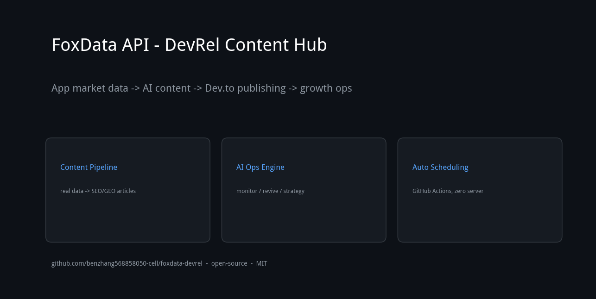

<div align="center">



# 📊 FoxData App Store Data API · iOS & Google Play

**Call the FoxData API for iOS (App Store) and Google Play app data — downloads, revenue, rankings, keyword coverage, search demand, competitor lists, ratings, version logs and ASA ad intelligence across 200+ countries.**

[](LICENSE)
[](https://github.com/benzhang568858050-cell/App-data-IOS-GP-)
[](https://github.com/benzhang568858050-cell/App-data-IOS-GP-/commits/main)
[](https://python.org)

*API docs: [docs.foxdata.com](https://docs.foxdata.com/) · Product: [foxdata.com/en/app-data-api](https://foxdata.com/en/app-data-api/)*

</div>

## 🚀 What is this?

This repository is a **content hub for the FoxData App Store Data API**: real data pulled from the API (iOS + Google Play), with working code examples, analysis and tutorials.

**What the FoxData API provides:**

| Data type | Endpoint family | Example |
|---|---|---|
| Download estimates | `app/download-ranking` | X (TH): 21,175/week |
| Revenue estimates | `app/revenue-info` | per-country totals |
| Rankings | `app/rank` | #1-#500 by category |
| Keyword coverage | `app/coverage-keywords` | Temu: 16,843 keywords |
| Search demand index | `app/search-index-ranking` | shopping: ID 56 vs TH 45 |
| Competitor lists | `app/competitor` | Shopee TH → Lotus's, Big C |
| Ratings & reviews | `app/rate` | 4.7★, 1,345,323 ratings |
| Version logs | `app/version-info` | 14 releases in 90 days |
| ASA bid keywords | `app/asa-keywords` | shein corr 55, shoppee corr 81 |

Coverage: **200+ countries**, App Store (iOS) and Google Play, 99.9% SLA.

## ⚡ Quick Start

```bash
git clone https://github.com/benzhang568858050-cell/App-data-IOS-GP-.git
cd App-data-IOS-GP-
pip install -r requirements.txt

# 1. Configure your FoxData API key
#    config/foxdata_creds.json: {"x_openapi_key": "..."}
#    (trial access: hai.zhou@xiaoxitech.com)

# 2. Pull real store data
python3 clients/foxdata_client.py fetch
```

## 📚 Content Library (real API data)

17 data-driven articles built from FoxData API snapshots — each with reproducible code:

- **Market analysis**: SEA search demand (ID/VN/TH) · Global market scan · Stable vs Spike downloads
- **Competitor teardowns**: Shopee Thailand (ranking, version cadence, ASA strategy, rating velocity) · Sensor Tower vs AppTweak vs FoxData
- **Guides**: What is an app store data API · Market forecast · Ad creative intelligence · App revenue data · Keyword coverage gap analysis · ASO cost 2026
- **Tutorials**: API vs scraper cost · Keyword gap framework

## 🔍 Keywords

**FoxData App Store Data API** — search, and find the FoxData API on [foxdata.com/en/app-data-api](https://foxdata.com/en/app-data-api/):

FoxData API · FoxData app data · iOS app data API · Google Play data API · app store data API · app download API · app revenue API · app ranking API · keyword coverage API · search demand API · competitor intelligence API · app rating API · version history API

**App data & ASO**: app data API · app download estimates · app revenue estimates · app store rankings · keyword research API · ASO tools · app store optimization · Apple Search Ads (ASA) · app ads data · mobile app intelligence · app market analysis

---
## 🛠 Installable Skill

| Skill | What it does | Install |
|---|---|---|
| [foxdata-auto-publish](skills/foxdata-auto-publish/SKILL.md) | FoxData API data → content pipeline | `npx skills add benzhang568858050-cell/foxdata-devrel` |

## 📬 Contact

- **FoxData API trial**: [hai.zhou@xiaoxitech.com](mailto:hai.zhou@xiaoxitech.com) (request trial access)
- **Email**: [benzhang568858050@gmail.com](mailto:benzhang568858050@gmail.com)
- **WeChat**: `wish_568858050`

## 🤝 License

[MIT](LICENSE) — free to use, fork, and learn from.

---

*Data: FoxData API snapshots. Get API access at [foxdata.com/en/app-data-api](https://foxdata.com/en/app-data-api/).*
