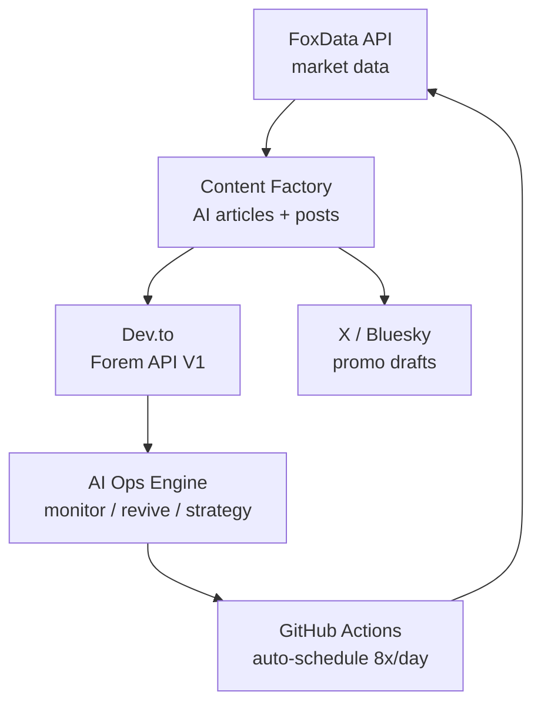

<div align="center">


# 📨 FoxData API · DevRel Content Hub

**Automated developer content operations powered by [FoxData API](https://foxdata.com/en/app-data-api/) — app market data → AI content → Dev.to publishing → growth ops.**

[](LICENSE)
[](https://github.com/benzhang568858050-cell/App-data-IOS-GP-)
[](https://github.com/benzhang568858050-cell/App-data-IOS-GP-/commits/main)
[](https://python.org)
[](.github/workflows/publish.yml)

*Self-hosted, free, one command: `python3 auto.py`*

</div>

## 🚀 What is this?

An open-source automation system that turns **app store market data** ([FoxData API](https://docs.foxdata.com/)) into published developer content — automatically. Built for teams promoting **mobile app data APIs / ASO tools** to the developer community.

**Key features:**

- 🤖 **AI content pipeline** — real market data → data-driven articles & posts (SEO-friendly titles, series interlinking, discussion prompts)
- 📝 **Dev.to automation** — publish long-form articles via the official Forem API (V1), with dedup & interval protection
- 📈 **AI ops engine** — hourly monitoring, engagement analysis, low-exposure auto-revive (title optimization), tag rotation strategy
- 🔁 **Multi-platform ready** — X (Twitter), Product Hunt, Bluesky, Threads clients included
- ⏰ **Free scheduling** — GitHub Actions cron, no server needed
- 🗂 **Content hub** — the repo itself is the content CMS (articles, drafts, data snapshots)

## 🎯 Who is this for?

- **DevRel / Developer Marketing teams** promoting an app data API or ASO tool
- **ASO managers** who want market data piped into content automatically
- **Indie developers** building a content engine around app market intelligence
- **Open-source DevRel practitioners** looking for a self-hosted alternative to paid social scheduling tools

## ⚡ Quick Start

```bash
git clone https://github.com/benzhang568858050-cell/foxdata-devrel
cd foxdata-devrel
pip install -r requirements.txt

# 1. Interactive setup (creates credential files, validates)
bash setup.sh

# Or manually: configure credentials (config/ dir, git-ignored)
#    config/devto_creds.json: {"api_key": "..."}  → dev.to Settings → API Keys

# 2. One-command automation: fetch data → plan → publish
python3 auto.py

# 3. AI ops engine: monitor → analyze → revive → interlink → strategy
python3 auto.py devto-ops
```

Requires: Python 3.10+, `pip install requests twikit` (project-local `.deps/` supported).

## 🏗 Architecture



## 📁 Project Structure

```
├── clients/
│   ├── devto_client.py    # Dev.to publishing (Forem API V1, frontmatter-safe)
│   ├── devto_engine.py    # AI ops: monitor/analyze/revive/inject/report
│   ├── devto_stats.py     # Engagement weekly report
│   ├── foxdata_client.py  # FoxData Open API (x-openapi-key, pagination, retry)
│   ├── x_client.py        # X/Twitter (twikit, cookie-based)
│   └── ph_client.py       # Product Hunt (GraphQL)
├── content/articles/      # Long-form articles (Markdown + frontmatter)
├── posts/drafts/          # Short posts
├── data/                  # Market data snapshots
├── auto.py                # One-command entry
└── .github/workflows/     # Hourly auto-publish pipeline
```

## 🔍 Keywords

**App data APIs**: app data API · app download API · app revenue API · app store data API · google play data API · app market data API · app intelligence API · app analytics API

**Ads & ASO**: app ads data · Apple Search Ads (ASA) · ASO tools · app store optimization · keyword research API · app ranking API · download estimates API · revenue estimates API

**Automation & DevRel**: social media automation · content automation pipeline · Dev.to automation · developer content ops · self-hosted automation · open-source alternative · DevRel toolkit · blog automation · markdown publishing · GitHub Actions workflow · LLM agents

---
## 📊 Publish Status

{{PUBLISH_STATUS}}

## 📚 Documentation & Links

- [FoxData Open API docs](https://docs.foxdata.com/) — authentication (`x-openapi-key`), endpoints, error codes
- [FoxData App Data API](https://foxdata.com/en/app-data-api/) — subscription plans
- [Dev.to API (Forem V1)](https://docs.forem.com/api/) — the publishing channel

### 📖 Ops playbooks (in this repo)

- [Dev.to Growth Playbook](docs/devto-growth-playbook.md) — engagement & exposure strategy
- [Developer Forums Distribution Matrix](docs/developer-forums-distribution-matrix.md) — where to share content
- [Content Strategy Guide](docs/foxdata-content-guide.md) — content mix & cadence
- [AI-SEO Guide](docs/ai-seo-guide.md) — AI-search citation optimization
- [Open Source Tools Research](docs/devto-open-source-tools-research.md) — what to reuse vs build

### 🛠 Installable Skills

| Skill | What it does | Install |
|---|---|---|
| [devto-operations](skills/devto-operations/SKILL.md) | Dev.to publishing + AI ops engine (monitor/revive/strategy) | `npx skills add benzhang568858050-cell/foxdata-devrel` |
| [foxdata-auto-publish](skills/foxdata-auto-publish/SKILL.md) | Data → content → multi-platform publishing | same package |
| [x-automation](skills/x-automation/SKILL.md) | X account automation (matrix edition) | same package |

> Battle-tested: running live on Dev.to — 5+ articles auto-published, hourly ops engine, 2-3 comments/day.

## 🧠 Content Strategy

Data-driven developer content, weekly cadence:
- 40% market insights · 20% keyword intelligence · 15% API tutorials · 10% ranking reports · 10% competitor teardowns · 5% product updates
- Best publish window: UTC 13:00–18:00 (data-backed)
- Series interlinking + discussion prompts on every article

## 📬 Contact

- **FoxData API trial**: [hai.zhou@xiaoxitech.com](mailto:hai.zhou@xiaoxitech.com) (request trial access)
- **Email**: [benzhang568858050@gmail.com](mailto:benzhang568858050@gmail.com)
- **WeChat**: `wish_568858050`
- **GitHub**: [benzhang568858050-cell](https://github.com/benzhang568858050-cell)
- **Dev.to**: [@_a29a85391c475e16a6bed4](https://dev.to/_a29a85391c475e16a6bed4)

## 🤝 License

[MIT](LICENSE) — free to use, fork, and learn from.

---

*Maintained by devrel-bot · auto-updated hourly*
