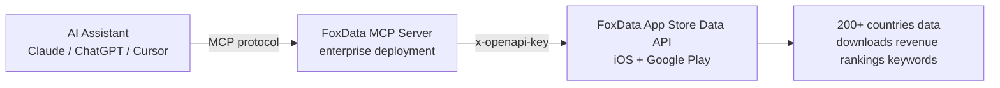

# FoxData MCP Server: App Data MCP & ASO MCP for Enterprise AI Assistants

> Last updated: 2026-08-22 · Data: FoxData API + MCP toolset

## What is an MCP server for app store data?

An MCP (Model Context Protocol) server lets AI assistants like Claude, ChatGPT and Cursor call external data tools directly. FoxData's MCP server connects internal AI assistants to iOS App Store and Google Play data — instead of writing Python or curl, you ask in natural language and get real store data back. It is currently deployed for **enterprise/internal use**, with public release planned.

## What you can ask

| Question | MCP tool behind it |
|---|---|
| "Top 10 shopping apps in Thailand by downloads?" | `get_download_ranking` |
| "Compare Shopee vs Temu keyword coverage in TH" | `get_app_coverage_keywords` |
| "What is Shopee's ASA keyword strategy?" | `get_app_asa_keywords` |
| "Who are Shopee Thailand's competitors?" | `get_app_competitors` |
| "What's the rating trend for X app?" | `get_app_rate` |
| "Which SEA country leads gaming demand?" | `get_search_index_ranking` |

Sixteen tools total — covering downloads, revenue, rankings, keywords, search demand, competitors, ratings, versions, ASA bids, reviews and global charts.

## Worked example: a 30-second market scan

**Prompt**: "Which SEA country leads shopping app demand, and who are the top apps?"

**MCP sequence**:
1. `get_search_index_ranking` → shopping: Indonesia 56, Vietnam 47, Thailand 45
2. `get_download_ranking` (ID) → top shopping apps in Indonesia
3. `get_app_competitors` (category leader) → competitive set

**Result**: a complete market snapshot — demand ranking, adoption leaders, and competitive landscape — in three tool calls, no code.

## Why enterprises deploy MCP servers for market data

1. **AI-native workflows**: analysts ask questions directly; no dashboard training needed
2. **Consistent data**: the same FoxData API underneath — same coverage (200+ countries), same accuracy
3. **Controlled access**: internal deployment keeps data governance in-house
4. **Compound automation**: combine store data with internal analytics, reporting and content generation

## The architecture

## FAQ

### What is an MCP server?

Model Context Protocol — the standard that lets AI assistants call external tools. An MCP server exposes data/tools to any MCP-compatible assistant.

### Is the FoxData MCP server publicly available?

Currently it is deployed for enterprise/internal use; public release is planned. Contact hai.zhou@xiaoxitech.com or WeChat `wish_568858050` for access.

### What data can I get through the MCP server?

The same data as the FoxData API: downloads, revenue, rankings, keyword coverage, search demand, competitors, ratings, version logs, ASA keywords, reviews, global charts — across 200+ countries.

### How is MCP different from the REST API?

REST API is for developers building integrations; MCP is for AI assistants and natural-language workflows. Both sit on the same FoxData data foundation.

### Which AI assistants support MCP?

Claude (Claude Desktop/Code), ChatGPT, Cursor, Codex and other MCP-compatible agents.

### How do I get MCP access for my team?

Enterprise/internal deployment access: contact hai.zhou@xiaoxitech.com.

## Discussion

Have you used MCP servers in your data workflows? What app market questions would you ask an AI assistant first? Comment below.

Questions or collaboration? Reach me at [benzhang568858050@gmail.com](mailto:benzhang568858050@gmail.com).

---

*Sources: FoxData API & MCP toolset, 2026-08-20. Get API access at [foxdata.com/en/app-data-api](https://foxdata.com/en/app-data-api/).*

> ⭐ **Star this project on GitHub** — it builds this content automatically.
