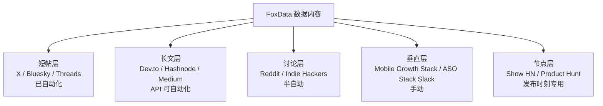

# 开发者论坛分发矩阵（FoxData API 内容方向）

> 目的：为 FoxData App Data API（移动应用市场数据 API）内容找到最合适的开发者聚集地，建立「短帖引流 + 长文沉淀 + 社区讨论 + 节点发布」的分层分发体系。
> 调研日期：2026-08-20（多源交叉验证）

---

## 一、总体框架：四层分发体系

---

## 二、长文平台（主阵地，API 可自动化）⭐

| 平台 | 受众 | 为什么适合 | 自动化能力 | 发什么 |
|---|---|---|---|---|
| **[Dev.to](https://dev.to)** | 130 万+ 开发者，技术内容消费强 | 开发者工具/API 教程的天然读者群；SEO 权重高 | ✅ **官方 API 免费**，Markdown 直接发布 | 「用 FoxData API 构建竞品监控面板」系列教程；数据方法论 |
| **[Hashnode](https://hashnode.com)** | 开发者博客社区，技术圈层 | 开发者博客 + 社区双属性；支持自定义域名 | ✅ **GraphQL API 免费**，Markdown 发布（甚至有 GitHub Actions 一键同步方案） | 与 Dev.to 同文复用（一稿多投） |
| **Medium** | 大众科技读者 | 流量池大，但开发者浓度低于前两者 | ⚠️ API 可用但权限受限（需集成 token） | 精选长文二次分发 |
| **Hacker News** | 全球顶级开发者/创业者 | **2026 年共识：Show HN 是开发者工具/API 类产品最有价值的发布渠道** | ❌ 无官方发布 API，手动提交 | 数据产品/API 上架时发 "Show HN"（真实用户故事 + 数据示例） |
| Lobsters | 资深工程师（邀请制） | 质量极高 | ❌ 手动 | 有邀请后转发技术文章 |

**自动化方案（强烈建议接入）**：Dev.to + Hashnode 官方 API → 一篇 Markdown 长文自动同步两平台，可完全纳入现有定时任务体系。

---

## 三、讨论型社区（半自动/手动，垂直精准）⭐

### Reddit 社区矩阵

| Subreddit | 规模/热度 | 定位 | 发什么 | 注意 |
|---|---|---|---|---|
| **r/AppStoreOptimization** | 24.6K+ | ASO 垂直核心社区（最匹配） | 关键词指数洞察、榜单变化、ASO 方法论 | **禁广告**；发"数据发现+方法"帖，评论区自然引流 |
| **r/iOSProgramming** | 大 | iOS 开发者 | 数据 API 集成教程、App 市场趋势 | 技术向，少营销味 |
| **r/SideProject** | 大 | 独立开发者 | 用 FoxData API 做的工具/面板展示 | 展示作品时可提 API 依赖 |
| **r/indiehackers** | 大 | 独立开发者变现 | 市场机会洞察（如东南亚数据） | 价值内容为主 |
| **r/buildinpublic** | 活跃 | Build in Public | 产品开发过程 + 数据发现 | 天然接受自我推广，但要真实 |
| r/marketing | 大 | 营销人 | 移动营销数据报告 | 泛营销，效果一般，可选 |

> 2026 实测共识：**Reddit + Indie Hackers 帖子对早期用户获取的效果是 Product Hunt 的 3-8 倍**，且不是一次性流量。
> Reddit 自动化：官方 API 免费可发帖（script app），但新账号需先养 karma/年龄；**建议前期手动，账号成熟后（1-2 个月）再半自动化**。

### Indie Hackers

- 独立开发者+创业者聚集地，threads 形式（可发长文/更新/讨论）
- 发：市场洞察、API 产品开发日志、数据发现
- 无官方 API，手动发；效果被验证为早期用户获取最优渠道之一

---

## 四、垂直 Slack/Discord 社区（手动，高价值）⭐

精准触达 ASO/移动增长从业者，量小但转化质量最高：

| 社区 | 背景 | 适合动作 |
|---|---|---|
| **[Mobile Growth Stack Slack](https://phiture.com/mobile-growth-stack-slack-community/)** | Phiture 运营，全球移动从业者网络 | 数据洞察分享、案例讨论、回答问题建立权威 |
| **[ASO Stack Slack](https://incipia.co/post/join-the-aso-stack-slack-group/)** | 1300+ ASO 专家（Incipia + Phiture 维护） | 关键词/排名数据讨论、专家人设经营 |
| **Angle ASO & ASA Experts Group** | ASOdesk 运营 | ASA/ASO 实操讨论 |

> 规则：这些社区反硬广，以「分享数据发现 + 帮助回答问题」入场，签名/简介放产品链接。每周 2-3 次高质量互动即可。

---

## 五、节点型平台（发布时刻专用）

| 平台 | 用途 | 自动化 | 策略 |
|---|---|---|---|
| **Product Hunt** | API 新品/大版本上线 | ✅ 官方 API（发产品） | 每年 1-2 次大发布；配合 X/Bluesky 预热 48h |
| **RapidAPI Hub** | API 上架市场 | ✅ 平台托管 | 把 FoxData API 上架到 API 市场，获取 API 开发者流量（注意与官方渠道协调） |
| **Stack Overflow** | 问答建立权威 | ❌ | 回答 ASO/数据 API 相关问题，签名/资料引流（非发布渠道） |

---

## 六、内容再加工矩阵（一鱼多吃）

同一个 FoxData 数据洞察，按渠道再加工：

| 原始素材 | 短帖（已自动化） | 长文（可自动化） | 讨论帖（半自动） | 垂直社区（手动） |
|---|---|---|---|---|
| 东南亚电商排名洞察 | X/Bluesky 数据帖 | Dev.to/Hashnode：「用数据 API 跟踪东南亚电商战局」 | r/AppStoreOptimization 数据帖 | ASO Stack 分享发现 |
| 关键词指数对比 | X 关键词情报帖 | 「VN vs TH：搜索需求差异分析」 | r/indiehackers 市场机会帖 | Mobile Growth Stack 讨论 |
| API 端点教程 | Bluesky 干货帖 | 「5 个端点搭建竞品监控面板」教程 | r/iOSProgramming 教程 | 社区答疑引链接 |
| 榜单周报 | 周报短帖系列 | 月度深度报告 | r/marketing 月度报告 | 垂直社区周报栏目 |

---

## 七、接入建议与每周节奏（低频版）

### 接入优先级

1. **P1（本周可做）**：Dev.to + Hashnode API 长文发布模块（免费、官方 API、与现有定时体系同构）——每周 1 篇长文双平台同步
2. **P2（2 周内）**：Reddit 账号养号启动（注册 → 每日 2-3 次正常互动 → 1 个月后开始发帖）；加入 2 个垂直 Slack
3. **P3（节点型）**：FoxData API 发布/更新时走 Show HN + Product Hunt（需要产品侧配合）

### 每周内容日历（叠加在现有 X/Bluesky/Threads 之上）

| 周一 | 周二 | 周三 | 周四 | 周五 |
|---|---|---|---|---|
| 榜单周报（短帖） | Reddit 数据帖 | **Dev.to+Hashnode 长文** | 垂直 Slack 分享 | Reddit 讨论互动 |

### 红线规则（防封号/防社区反感）

1. Reddit/Slack 社区**禁止直接发广告链接**——先发价值，链接放评论区或资料页；违反会被永久封禁
2. Dev.to/Hashnode 文章需标注数据来源与时间（"Data: FoxData API, Aug 2026"），保持学术诚实
3. 同内容多平台发布时改写 >30% 文字，避免 SEO 重复惩罚
4. HN Show HN 规则：只能发自己的项目，标题诚实（不夸大），帖子内放数据示例而非广告语
5. 所有自动化发布频率保持「人类水平」：长文每周 1-2 篇、Reddit 每周 2-3 帖

---

## 八、结论

最值得投入的论坛组合（按性价比排序）：

1. **Dev.to + Hashnode（API 自动化）**——成本最低、可完全自动化、开发者浓度高
2. **Reddit r/AppStoreOptimization + r/indiehackers**——垂直精准、效果被验证优于 Product Hunt，但需养号
3. **Mobile Growth Stack + ASO Stack Slack**——转化质量最高的 1300+ 精准从业者
4. **Show HN**——产品发布节点的最强渠道
5. Product Hunt / Medium / Lobsters——节点型补充
