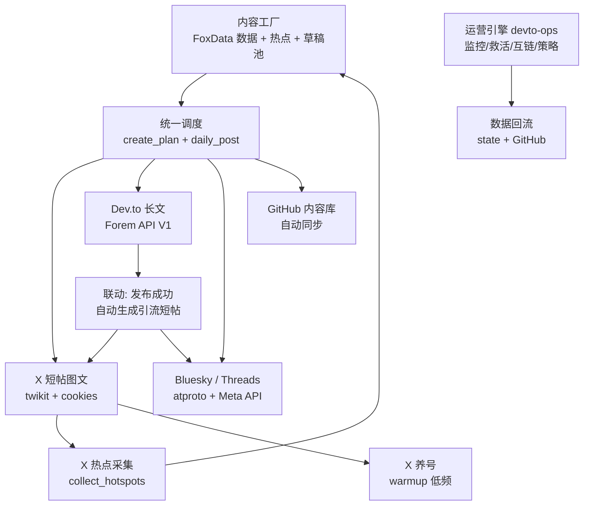

# 多平台内容矩阵架构（Matrix Architecture）

> 统一内容工厂 → 多平台分发 → 运营引擎 → 数据回流。X + Dev.to + Bluesky/Threads + GitHub。

## 架构图



## 平台分工

| 平台 | 内容形态 | 频率 | 通道 | 状态 |
|---|---|---|---|---|
|---|---|---|---|---|
| **X** | 短帖图文（≤270 权重） | 0-2 条/天 | twikit + cookies | ⬜ 凭据待配 |
| **Dev.to** | 长文（系列 + 互链 + 讨论引导） | 每周 1-2 篇 | Forem API V1 | ✅ 已上线 |
| **Bluesky** | 短帖（≤300 字符） | 0-1 条/天 | atproto | ⬜ 凭据待配 |
| **Threads** | 短帖（≤500 字符） | 0-1 条/天 | Meta Graph API | ⬜ 凭据待配 |
| **GitHub** | 内容库 + 定时器 | 每天 3 次同步 | Actions | ✅ 已上线 |

## 矩阵联动（核心机制）

1. **Dev.to 文章发布成功** → 自动生成 X + Bluesky 引流短帖草稿（标题 + 链接 + 标签），次日自动发布
2. **X 热点采集**（collect_hotspots）→ 选题源补充（与 foxdata 数据并行）
3. **X 养号**（warmup）→ 低频真人行为（点赞 8-15/天、关注 1-3/天，间隔 25-90s 随机）
4. **跨平台错峰**：每平台独立窗口 + 间隔保护（post_gap_min ≥60 分钟）
5. **统一防重**：文件名去重 + published.json 全平台记录

## 发布调度（随机化，风控合理）

- **发布时间随机化**：Dev.to/Hashnode 文章到期后，发布时刻 = 当天 08:00-22:00 随机（或今天到期则 1-10 小时内随机）——无固定规律，模拟人类作者
- **检查频率与发布频率解耦**：Actions 每 3 小时检查一次计划（检查≠发布），实际发布发生在计划中的随机时刻
- 相邻文章发布时间自动错开（post_gap_min ≥60 分钟 + 随机窗口天然错开）

## 风控规则（矩阵红线）

| 平台 | 限制 | 保护机制 |
|---|---|---|
| X | 每日 ≤5 条；权重 ≤270；间隔 ≥45 分钟 | post_gap_min + 344/226 错误码处理 |
| Dev.to | 每周 1-2 篇；每篇外链 ≤2；锚文本多样化 | devto-ops 监控 |
| Bluesky/Threads | 每平台每天 0-1 条 | 间隔保护 |
| 跨平台 | 同一内容错峰发布（不同时刷屏） | 各平台独立计划窗口 |
| 养号 | 仅在固定 IP 环境运行（**勿放 GitHub Actions**——IP 频繁变化触发风控） | warmup.py 本地运行 |

## 命令速查

```bash
# devrel-automation（主系统）
python3 auto.py all          # 拉数据 → 计划 → 发布（X/Dev.to/PH）
python3 auto.py devto-ops    # Dev.to 运营引擎
python3 clients/collect_hotspots.py   # X 热点采集
python3 clients/warmup.py    # X 养号（本地运行！）

# bs-automation（Bluesky/Threads）
cd /mnt/user-data/workspace/bs-automation
python3 create_plan.py && python3 daily_post.py

# 一键矩阵（本地）
python3 auto.py all && python3 auto.py devto-ops \
  && (cd ../bs-automation && python3 create_plan.py && python3 daily_post.py)
```

## 凭据清单（矩阵启动所需）

| 平台 | 凭据 | 配置位置 |
|---|---|---|
| X | Cookie-Editor cookies | `devrel/config/x_cookies.json` |
| Bluesky | handle + App Password | `bs/config/bluesky_creds.json` |
| Threads | Meta 开发者 token | `bs/config/threads_creds.json` |
| FoxData API（可选） | x_openapi_key（付费订阅） | `devrel/config/foxdata_creds.json` |
